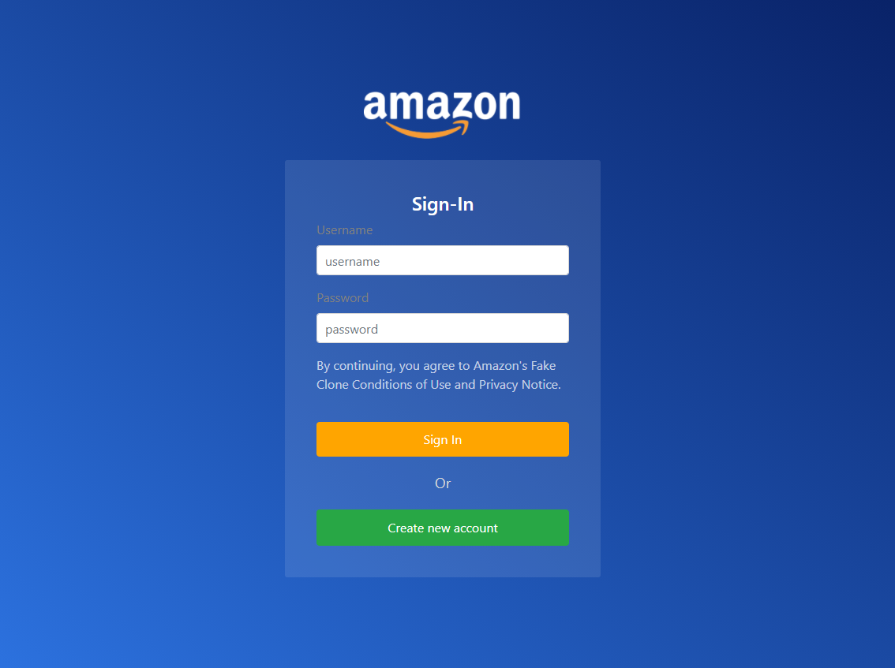
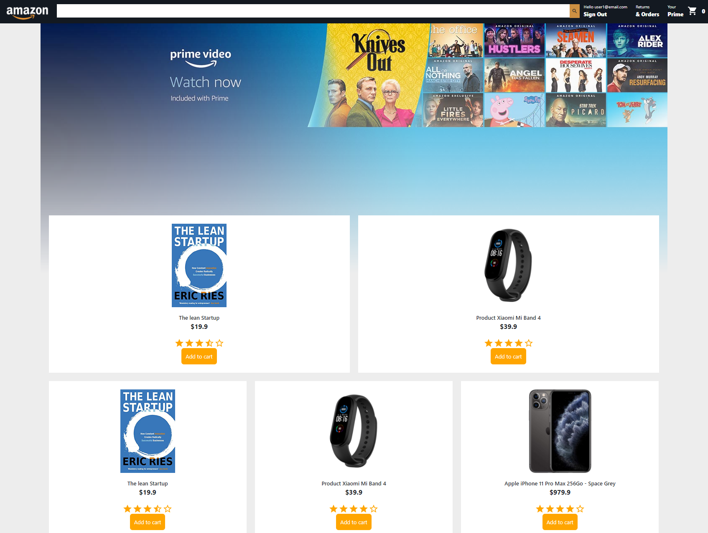
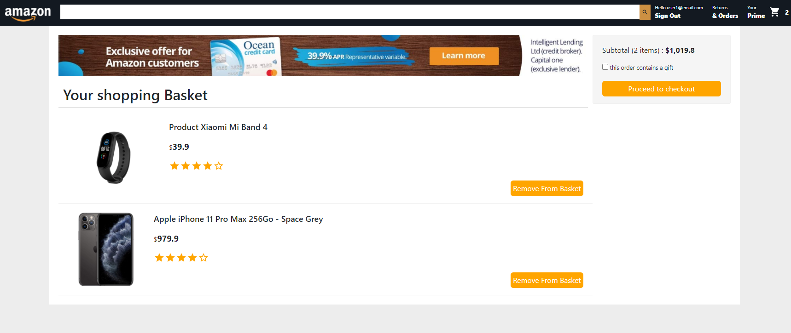
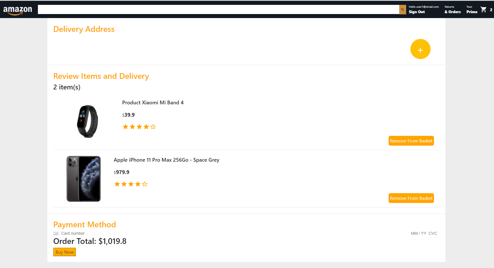

# Amazon Clone

Live Preview: https://challenge-22824.firebaseapp.com/

- username: user1@email.com
- password: testamazon

An e-commerce web application where the user can simulate purchase on the store. the App connects to Stripe API (https://stripe.com/fr) to handle the payment requests.

As a backend, it uses Firebase backend functions via axios HTTP requests that send Orders to Stripe. Authentication is also handled with Firebase API. 

## Project status

The nexts steps are: 

- As a user, I want the view to be responsive and adapted to smaller screens
- As a user, I want to keep an open session to persist the basket of purchases when i refresh the page
- As a user, I want an implmentation to use the search bar

## Stack
Javascript

Framework : Reactjs

Middleware : Context API for state management

GUI library: Bootstrap

## Visuals

SignIn page: 

Credential tests: 

username : "user1@email.com"

password: "testamazon"

Main page:

Checkout page:

Payment page:

